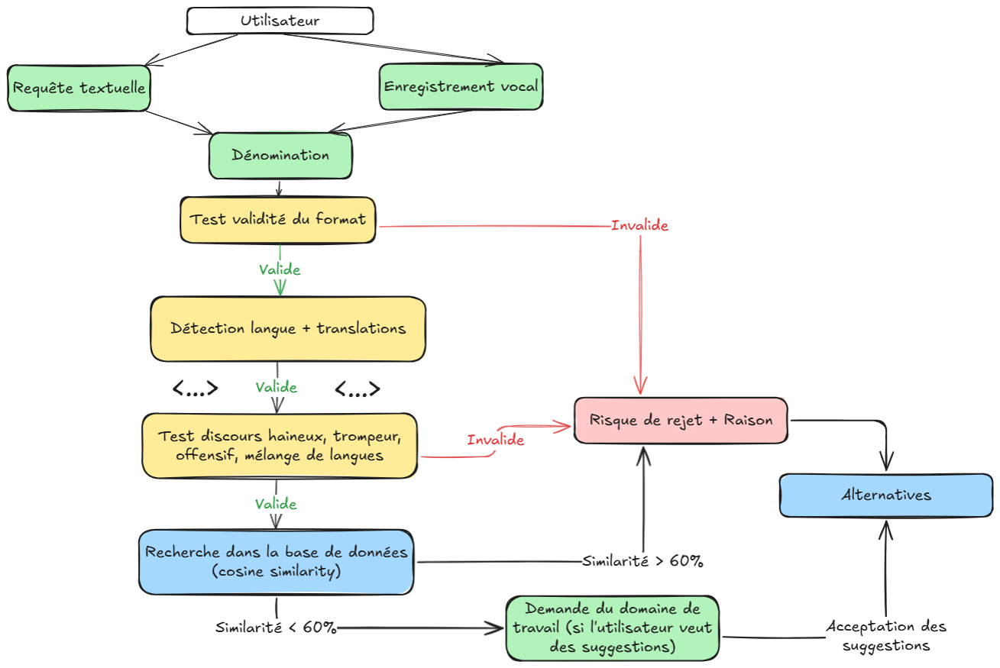
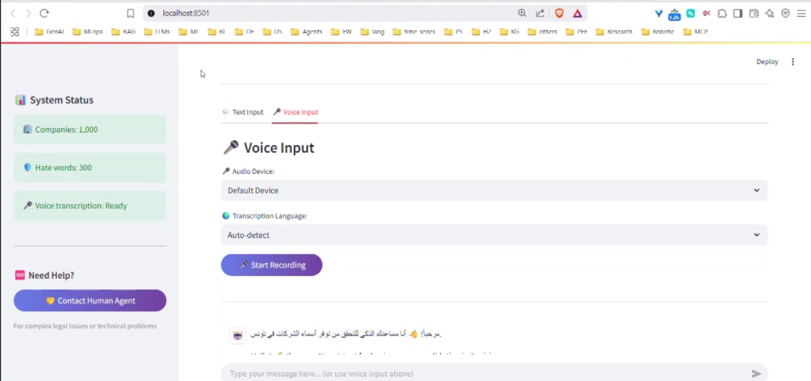
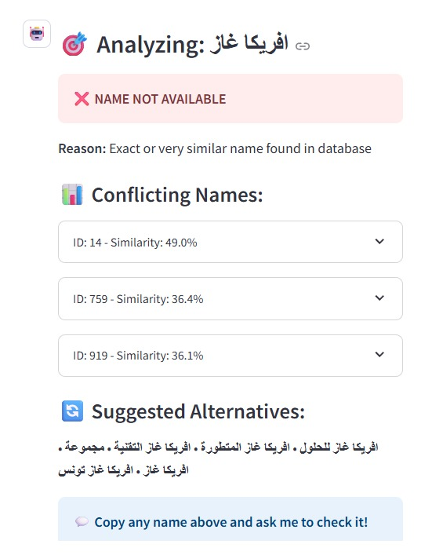
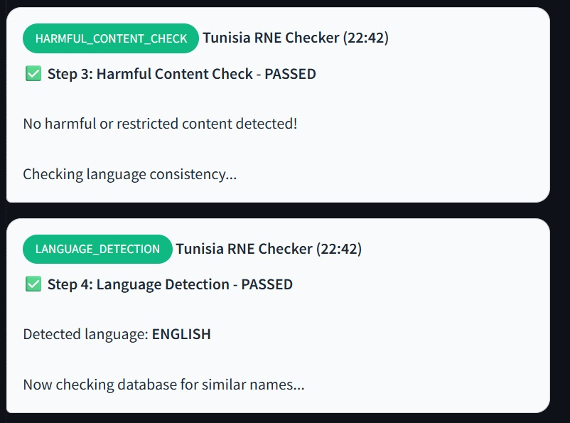
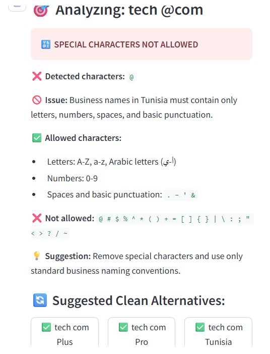
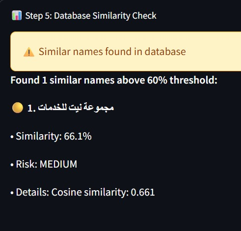
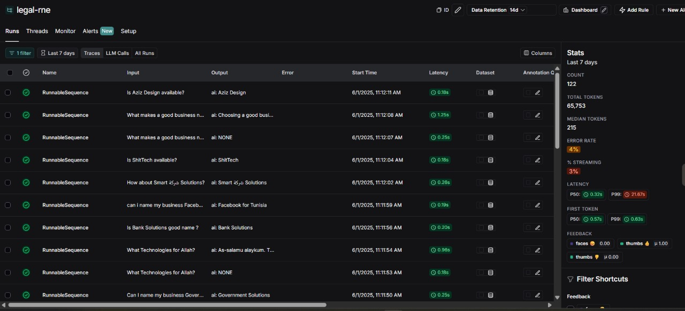
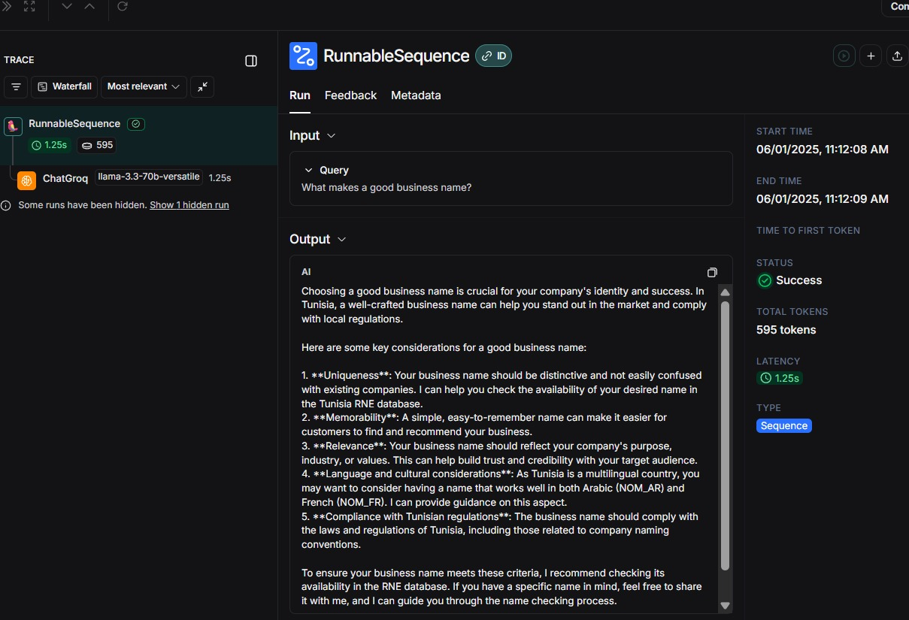
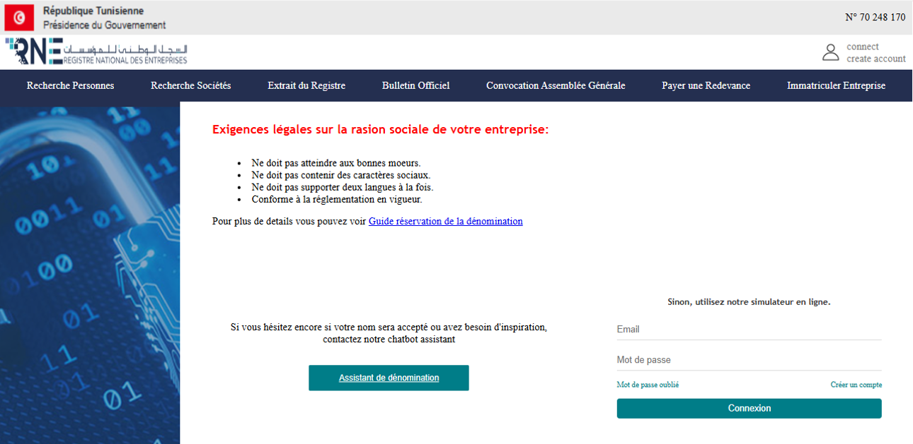
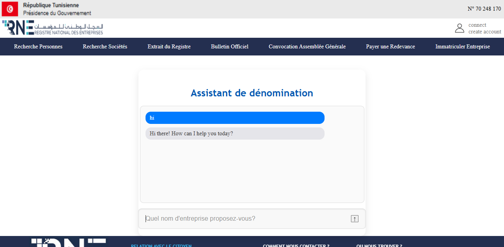

# AI-Powered Applications Suite by Team ZERO_GPU

A production-ready suite of Streamlit apps powered by advanced AI technologies. No local installation required—just run and go.


*Complete business name validation workflow*

---

## Projects Overview

### 🎙️ Audio Transcription AI  
**Path:** `/speech_to_text/`  
Real-time audio transcription using OpenAI Whisper.


*Modern audio transcription interface with multi-language support*

**Features:**
- Real-time recording with live status
- Multi-language (Arabic, French, English, etc.)
- High-accuracy transcription
- Responsive UI with timestamps
- Automatic audio format conversion
- Audio device selection

**Use Cases:**  
Meetings, lectures, interviews, memos, content creation, language learning

---

### 🏢 Business Name Checker AI  
**Path:** `/denomination/`  
Validates business names against Tunisia's RNE with AI analysis.

 <br>
*Real-time business name validation with conflict detection*

**Features:**
- Name extraction from natural queries
- Checks for special characters, content, duplicates
- Real-time RNE database check
- Chat interface and name suggestions
- Similarity scoring with conflict analysis

#### Validation Examples

**✅ Available Name:**


**❌ Special Characters Blocked:**

*Automatic detection of prohibited characters with clean alternatives*

**⚠️ Similar Names Found:**


*Similarity analysis with risk assessment*

**Use Cases:**  
Branding, legal compliance, rebranding, startup naming

**Validation Rules:**
- **Allowed:** Letters, numbers, `. - ' &`
- **Disallowed:** Special characters like `@ # $ % ^ * ( ) + = [ ] { } | \ : ; " < > ? / ~`
- Inappropriate content detection and duplicate name checking

---

## 📊 Performance Monitoring



*Real-time performance monitoring with LangSmith integration*

### Performance Metrics
- **Latency:** P50: 0.32s, P99: 21.67s
- **Success Rate:** 96%+ across all operations
- **User Feedback:** Integrated thumbs up/down system



*Comprehensive performance tracking and user feedback analysis*

---

## 🏛️ Official Integration



*Integration with official Tunisia RNE (Registre National des Entreprises)*

Our Business Name Checker integrates with the official Tunisia RNE system to ensure:
- Real-time database validation
- Compliance with legal requirements
- Up-to-date business registry information



*Official RNE naming assistant integration*

---

## Built With

**AI & ML:**  
OpenAI Whisper, LangChain, Groq LLaMA 3.3, ChromaDB  

**Backend:**  
Streamlit, PyAudio, FFmpeg, LangSmith, vector stores  

**Frontend:**  
Modern CSS, mobile-ready UI, multilingual support, interactive chat, user feedback tracking

---

## Innovations by Team ZERO_GPU

**Zero-Installation:**  
Cloud-native, modular, scalable, and ready for production  

**AI-First:**  
Natural language understanding, multi-modal processing, real-time performance  

**Localization:**  
Arabic support, Tunisia-specific rules, RTL & LTR handling

---

## Quick Start

### Audio Transcription
```bash
cd speech_to_text/
streamlit run app.py
```

#### Audio Transcription: Quick Steps
1. Click **"Start Recording"**  
2. Speak  
3. Click **"Stop Recording"**  
4. Click **"Transcribe"**

---

### Business Name Checker
```bash
cd business-checker/
streamlit run app.py
```

#### Business Name Checker: Quick Steps
1. Ask: *"Is TechCorp available?"*  
2. View validation results  
3. Get name suggestions if needed  
4. Proceed with confidence

---

## Performance

### Audio Transcription
- **Speed:** 2–5x real-time  
- **Accuracy:** 95%+  
- **Languages Supported:** 10+

### Business Name Checker
- **Database Size:** 100K+ names  
- **Response Time:** <2 seconds  
- **Accuracy:** 98%+

---

## Screenshots Gallery

<details>
<summary>View More Screenshots</summary>

To be added ...

</details>

---

## Accessibility
- Screen reader support  
- Keyboard navigation  
- Font scaling  
- Multilingual UI

---

## Contributing

### Mission
Make advanced AI accessible through easy-to-use apps.

### Focus Areas
- Edge AI  
- Real-time inference  
- Multi-modal processing  
- Cultural adaptation

## Roadmap

### Audio Transcription 2.0
- Live streaming transcription  
- Smart summarization  
- API integration  
- Speaker identification

### Business Checker Pro
- Multi-country support  
- AI-based name generation  
- Market & competition insights  
- Legal document assistance

---

## Team ZERO_GPU
*Building the future of accessible AI applications* 🚀
